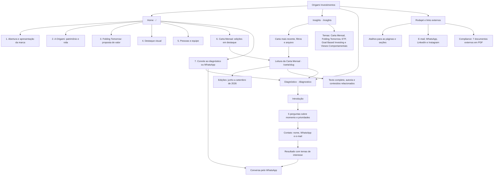

# Mapa do site — Origami Investimentos

Estrutura atual do projeto, organizada para apresentação à equipe.

## Como apresentar

- **Home:** apresenta a Origami, sua visão de patrimônio e a equipe.
- **Insights e cartas:** aprofundam o conteúdo e a perspectiva da empresa.
- **Diagnóstico:** conduz o visitante de suas prioridades a uma conversa com a Origami.
- **Rodapé:** reúne navegação, contato, redes sociais e documentos de compliance.

As seções da Home ficam na mesma página. Cada Carta Mensal tem sua própria página; os demais conteúdos de Insights apontam para trechos do próprio hub. As etapas do diagnóstico acontecem na mesma página.

**Ponto para alinhamento interno:** o formulário do diagnóstico ainda não persiste os dados em CRM ou Supabase; essa integração está pendente no código.
